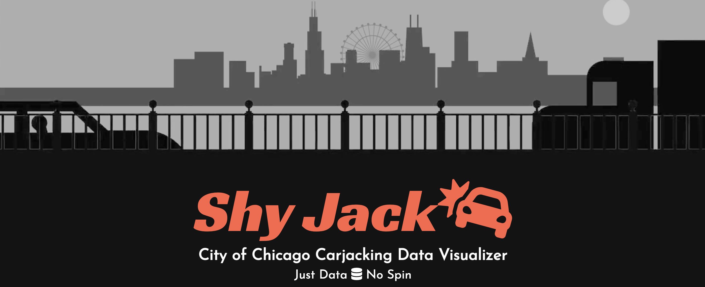
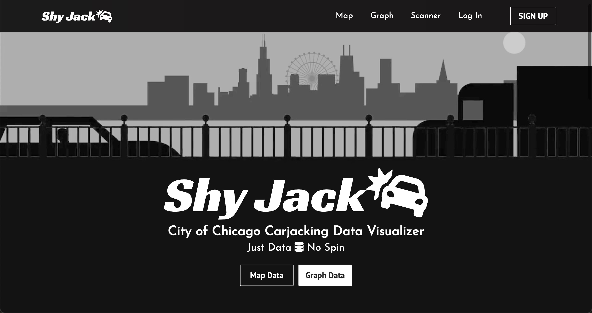
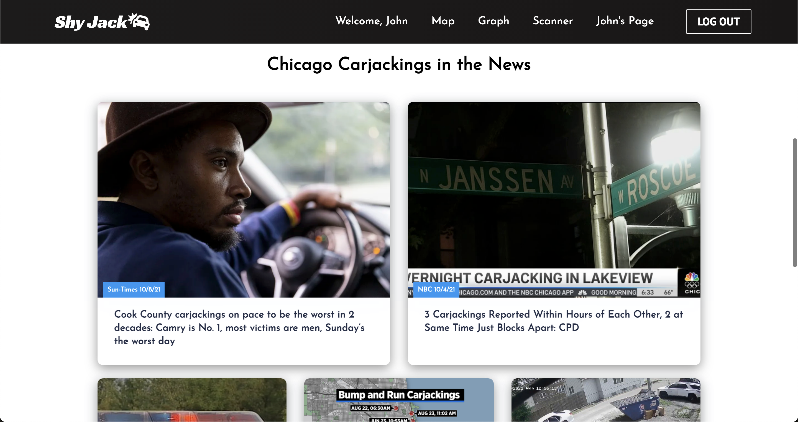
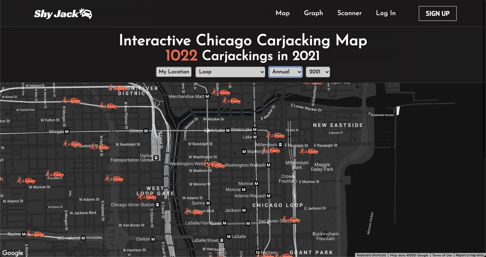
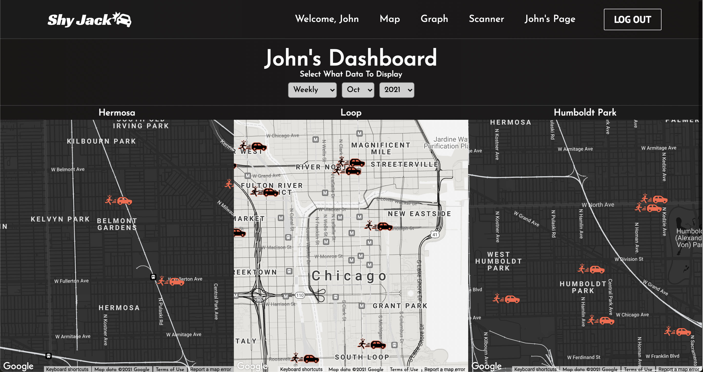
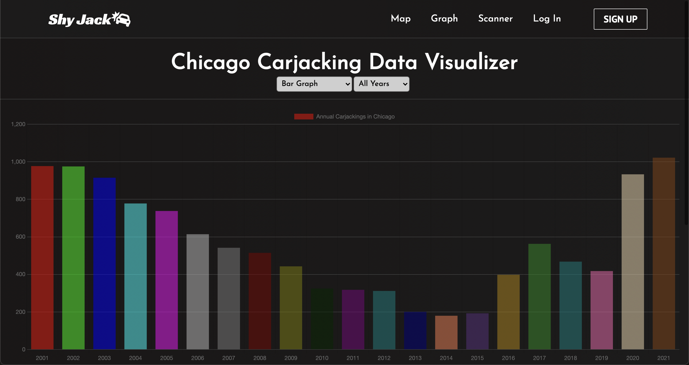
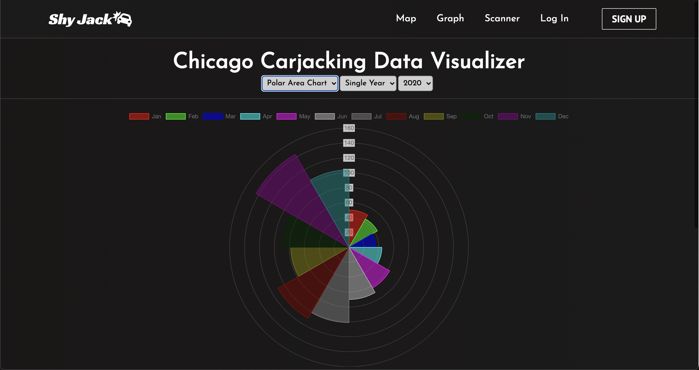

## About Shy Jack

Shy Jack: City of Chicago Carjacking Data Visualizer is a MERN stack application that allows users to map and graph carjacking data according to their search parameters, providing them access to easily understandable visual representations of the data. These visualizations make an enormous dataset approachable and make it easier to spot macro trends. Shy Jack is simple: Just Data, No Spin.

## The Dataset

Shy Jack taps into the Chicago Police Department's CLEAR (Citizen Law Enforcement Analysis and Reporting) system. This dataset reflects reported incidents of crime (with the exception of murders where data exists for each victim) that have occurred in the City of Chicago from 2001 to present, minus the most recent seven days. In order to protect the privacy of crime victims, addresses are shown at the block level only and specific locations are not identified. Shy Jack's data is composed of all crimes labeled as "AGGRAVATED VEHICULAR HIJACKINGS".

## Why Shy Jack?

Crime in Chicago often gets politicized and too frequently ends up on the national stage. Chicagoans end up wondering if things are as bad as they seem on the news... Could they be even worse than being reported? Why does the narrative being told by the news, politicians, and leaders in law enforcement seem to differ so greatly? In this city, it can be hard to know, but the raw data is publicly available via CLEAR (The Citizen Law Enforcement Analysis and Reporting) system.
I created Shy Jack to bring this important data directly to the great people of Chicago, free of any political or ideological spin. The numbers tell the story, Shy Jack illustrates it.

## Launch Shy Jack

Click [HERE](https://shy-jack-app.herokuapp.com/)

## Author

**John Nelson-Alden**

## Screenshots

    
     

    
     

    
     

## Built With

    
     

<!-- 
 -->

    
     

<!-- 
 -->

* [MongoDB](https://www.mongodb.com/)
* [Mongoose](https://mongoosejs.com/)
* [Express](https://expressjs.com/)
* [React](https://reactjs.org/)
* [Node.js](https://nodejs.org/)
* [Heroku](https://www.heroku.com/)
* [React Google Maps API](https://www.npmjs.com/package/@react-google-maps/api)
* [Chart.js](https://www.chartjs.org/)
* [Chicago Data Portal](https://data.cityofchicago.org/)
* [LottieFiles](https://lottiefiles.com/)
* [Font Awesome](https://fontawesome.com/)
* [Google Fonts](https://fonts.google.com/)
* [Pixabay](https://pixabay.com/)
