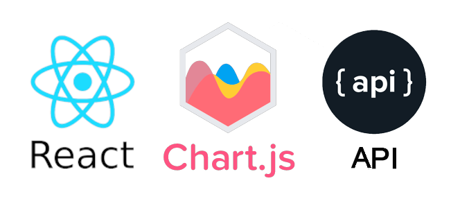

## Built With

* [MongoDB](https://www.mongodb.com/)
* [Mongoose](https://mongoosejs.com/)
* [Express](https://expressjs.com/)
* [React](https://reactjs.org/)
* [Node.js](https://nodejs.org/)
* [React Google Maps API](https://www.npmjs.com/package/@react-google-maps/api)
* [Chart.js](https://www.chartjs.org/)
* [LottieFiles](https://lottiefiles.com/)

## Author

**John Nelson-Alden**
